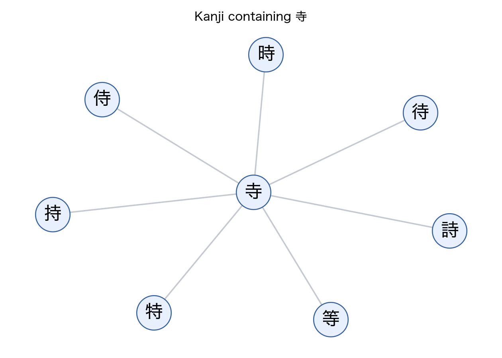

# Kanji Graph Demo

This repository contains the graph-only code and data for the DSS blog article on visualizing Japanese kanji as a component graph.

The graph represents component relationships as directed edges: `component -> kanji`. For example, `寺 -> 時` means that `寺` is a component of `時`. The committed graph data is enough to reproduce the code outputs and equivalent figures from the article without the original scrape.

## Quickstart

```bash
python3 -m venv .venv
source .venv/bin/activate
pip install -r requirements.txt
```

Query a kanji:

```bash
python src/main.py --kanji 時
```

Query all kanji that contain a component:

```bash
python src/main.py --component 寺
python src/main.py --component 司
```

Render equivalent graph figures:

```bash
python scripts/render_figures.py --component 寺 --component 木 --kanji 持 --output docs/figures
```

Generate deterministic worksheet input:

```bash
python src/worksheet_generation/worksheet_creator.py input_file=data/input_texts/test_input.txt level=5 --dry-run
```

With `OPENAI_API_KEY` in `.env`, the worksheet script can also generate Markdown tables using the hardcoded model `gpt-5.2` with `reasoning.effort="none"`.

## Data

Committed data:

- `data/kanji_digraph.gexf`: generated component graph used by the scripts.
- `data/kanji_nodes.csv` and `data/kanji_edges.csv`: graph exports for figure and external visualization workflows.
- `data/input_texts/test_input.txt`: short article input used by the worksheet demo.

Not committed:

- The full Jitenon scrape/source dump.
- Generated outputs under `outputs/`.
- Local API keys and `.env`.

The full scrape is not needed to reproduce the article code outputs. The included graph is the reproducibility artifact.

## Figures

The Python figure script produces equivalent graph views from the committed data:





These are not intended to be pixel-identical Gephi screenshots; they are scripted figures over the same graph representation.

## Linked Article Paths

The blog post links to these files, so they are kept as working entrypoints:

- [`src/main.py`](src/main.py)
- [`src/worksheet_generation/worksheet_creator.py`](src/worksheet_generation/worksheet_creator.py)

## Tests

```bash
python -m pytest
```
