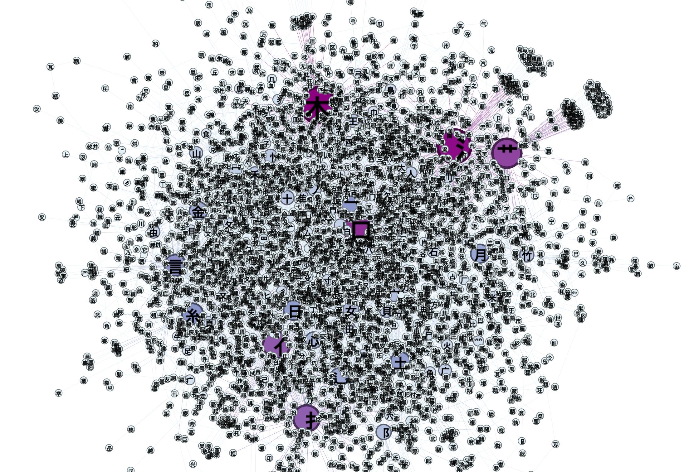
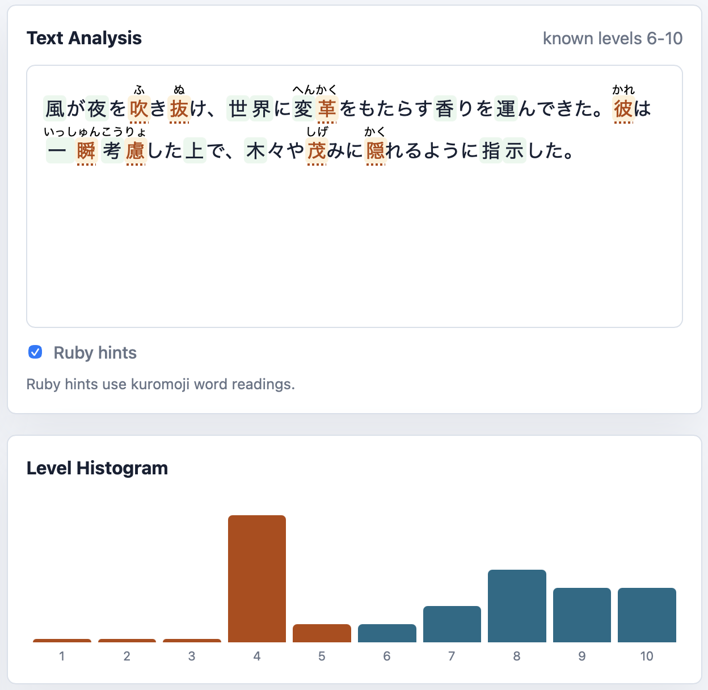

# Kanji Graph Demo

Code and data for the University of Tokyo Data Science School blog article [Visualizing All Kanji in a Graph](https://dss.i.u-tokyo.ac.jp/blog/visualizing-all-kanji-in-a-graph/).



Graph including 3000 kanji and 500 radicals. Kanji are connected to their components. Kanji with a higher degree (number of connections) are larger and purple.

The graph uses directed edges of the form `component -> kanji`, for example `寺 -> 時`.

The repository includes the generated graph data needed to reproduce the article’s code outputs and scripted figures.

Install dependencies with:

```bash
uv sync
```

## Browser demo

The static browser demo in [`demo/`](demo/) exposes the graph query, component graph, similarity graph, and kanji difficulty marking workflows in one UI. It runs entirely in the browser using the committed GEXF graph data.



Run it from the repository root:

```bash
python3 -m http.server
```

Then open <http://localhost:8000/demo/>.

The **Lookup** tab accepts either a kanji or a component. It shows kanji readings, components, similar kanji, containing kanji when relevant, and the corresponding graph. The **Text** tab lets you paste Japanese text, select a known-through level, and highlight unknown kanji; optional ruby hints use browser-loaded kuromoji word readings.

## Scripts

- [`src/main.py`](src/main.py): query kanji readings, components, and similar kanji.
- [`src/data_extraction/graph_builder.py`](src/data_extraction/graph_builder.py): small example showing how normalized kanji records become a component graph.
- [`src/worksheet_generation/worksheet_creator.py`](src/worksheet_generation/worksheet_creator.py): create worksheet input from Japanese text.
- [`scripts/render_figures.py`](scripts/render_figures.py): render small reproducible graph figures for the documentation.

## Data

- [`data/kanji_digraph.gexf`](data/kanji_digraph.gexf): generated graph used by the scripts.
- [`data/input_texts/test_input.txt`](data/input_texts/test_input.txt): sample text for the worksheet demo.
