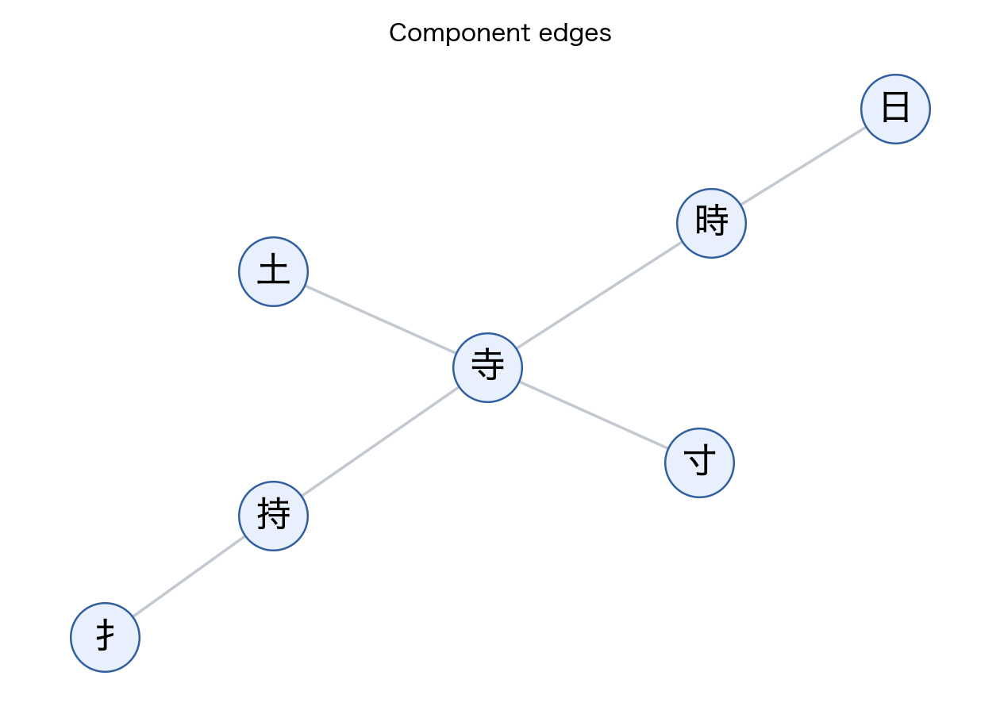

# Graph Construction

`graph_builder.py` demonstrates the transformation used to construct the kanji component graph after raw dictionary data has been normalized.

Each normalized record contains one kanji, its components, readings, level, and stroke count. The graph adds one node for the kanji, nodes for any missing components, and directed edges from each component to the kanji that contains it.

```bash
python src/data_extraction/graph_builder.py --output-dir outputs/example_graph
```

The full source scrape is intentionally not included. The committed `data/kanji_digraph.gexf` is the artifact used for reproducing the article outputs.


