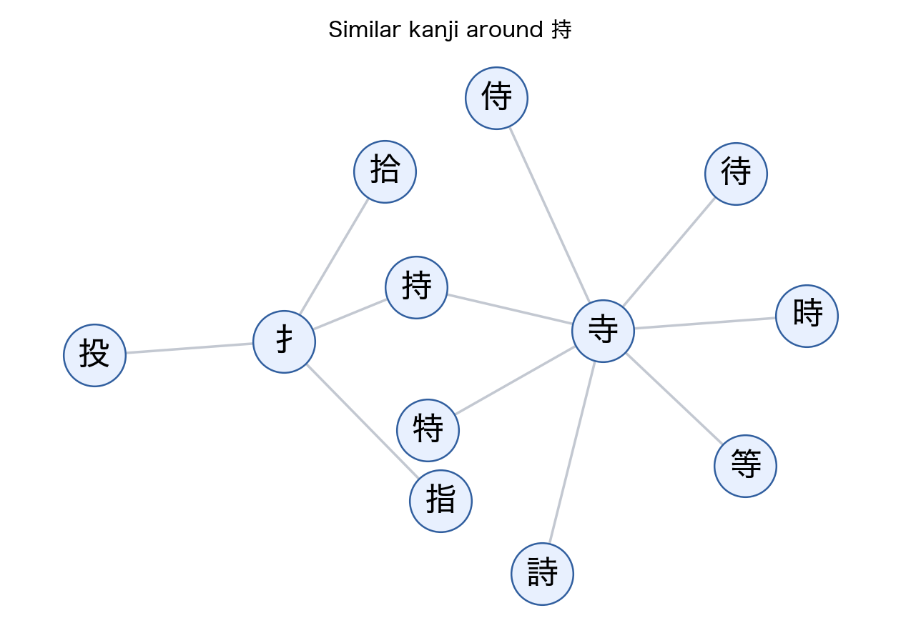

# Worksheet Generation

`worksheet_creator.py` turns an input Japanese text into worksheet input using the kanji graph.

The dry-run path is deterministic: it finds kanji at or below the selected level, extracts the word containing each kanji, adds reading hints, and includes similar kanji as warning items.

```bash
python src/worksheet_generation/worksheet_creator.py input_file=data/input_texts/test_input.txt level=5 --dry-run
```

If `.env` contains `OPENAI_API_KEY`, the script can ask `gpt-5.2` to turn the extracted input into Markdown tables. The model is hardcoded in the script and uses `reasoning.effort="none"` for low-latency table generation.

Generated files are written to `outputs/worksheets/`.


